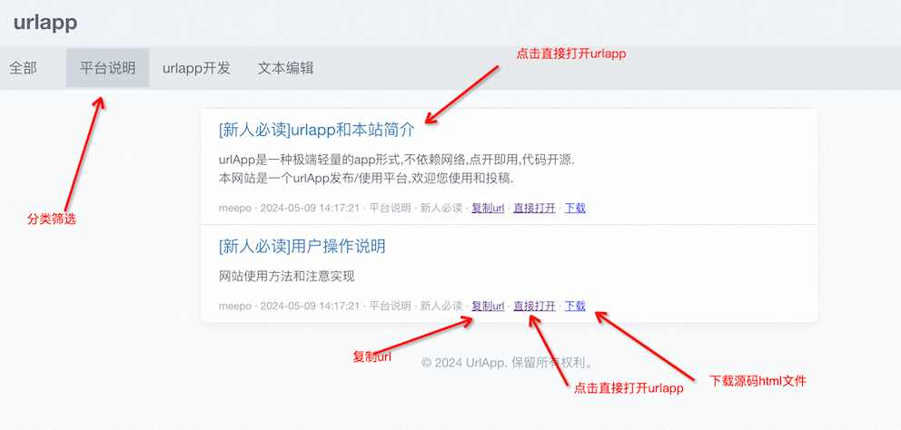

 

# 基本操作
顶部标签: 点击可分类过滤可用urlapp  

urlapp卡片: 点击卡片直接打开urlapp  

复制url: 点击复制url到剪贴板,粘贴到浏览器地址看即可打开使用  

直接打开: 点击后直接打开urlapp,和点击urlapp卡片效果一样  

下载: 下载urlapp的源代码,是一个html文件,可以保存后使用  

 

 
 
# 注意事项
## 1浏览器地址栏有最大url长度限制

大约是512k,这种情况直接粘贴url会被截断,导致urlapp不可用  

这种情况可以点击“直接打开”,或者“下载”html文件后使用  

 

## 2为了永久保存urlapp,并支持离线使用,您可以:

保存urlapp的url,需要时贴入浏览器地址栏使用  

使用url打开后,直接添加书签,后面通过书签访问(书签会保存url,也就保存了全部代码)  

下载html文件,本地打开使用  

 

 

 